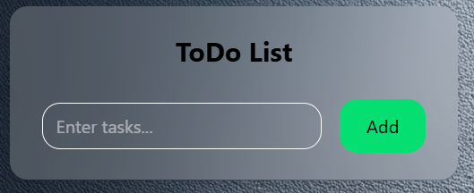
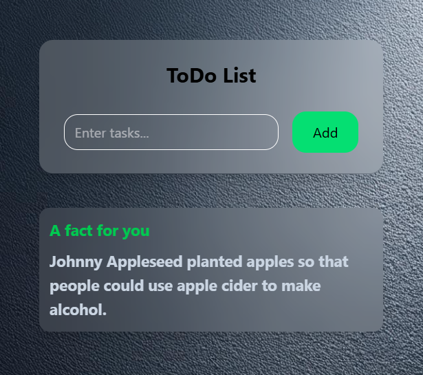
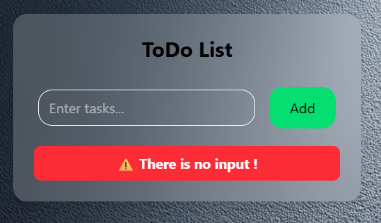
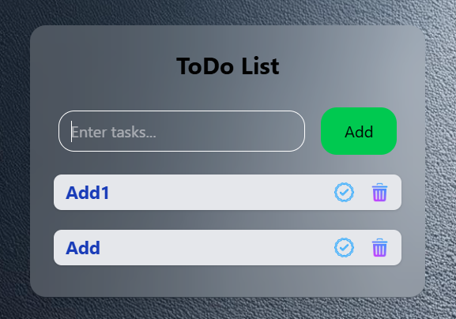
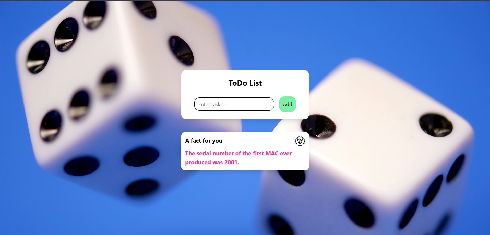

# Todo List

A simple Todo List application built using HTML, CSS, and JavaScript. This project is made for DOM manipulation practice and mastery.

# Live Link

https://todo-list-iota-silk-22.vercel.app/

# Features

* Add new tasks
* Prevent empty input
* Add a line through as markdone
* Delete task
* Clean UI
* Local storage(Task will save, auto load) 

# Added Feature
* A fact Box which will show a random fact, on every refresh the fact will change

# Tech Stack

* HTML
* Tailwind Css
* JavaScript (DOM Manipulation)

# Key Concepts Used

* `document.querySelector()`
* `addEventListener()`
* `insertAdjacentHTML()`
* `.trim()`
* `async await`

# Learning Outcome

This project helped in understanding:

* How JavaScript interacts with HTML using the DOM
* Event handling in real applications
* Api handling

# Screenshots
# Normal Look

# Look with fact box

# No input error

# Added value look

# Full page look

# Author

*Sisir Sen*

